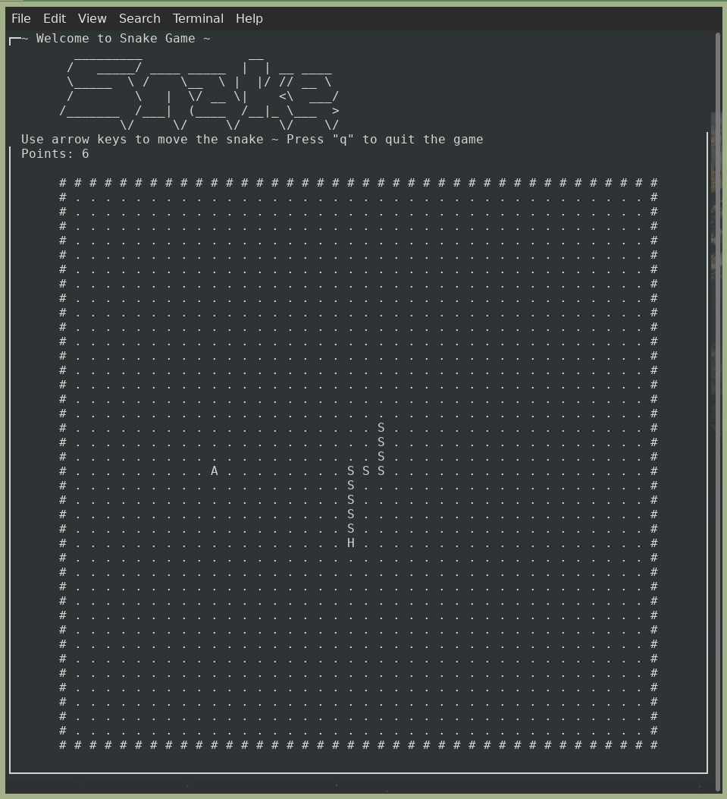
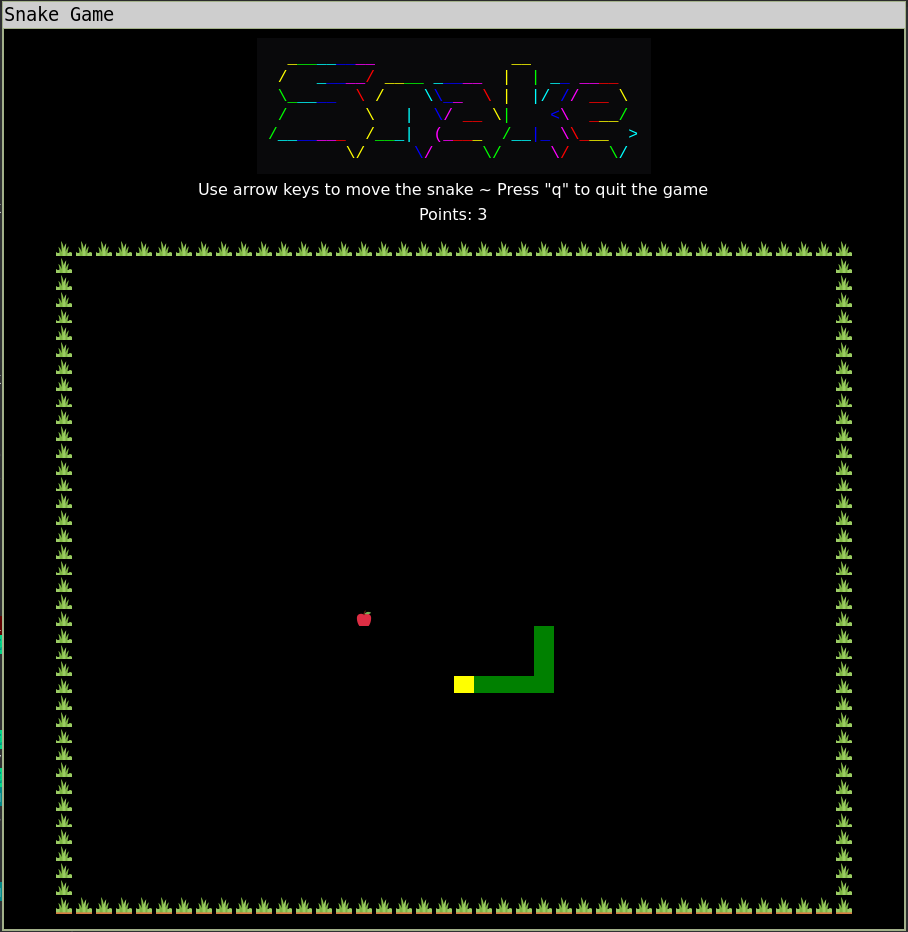
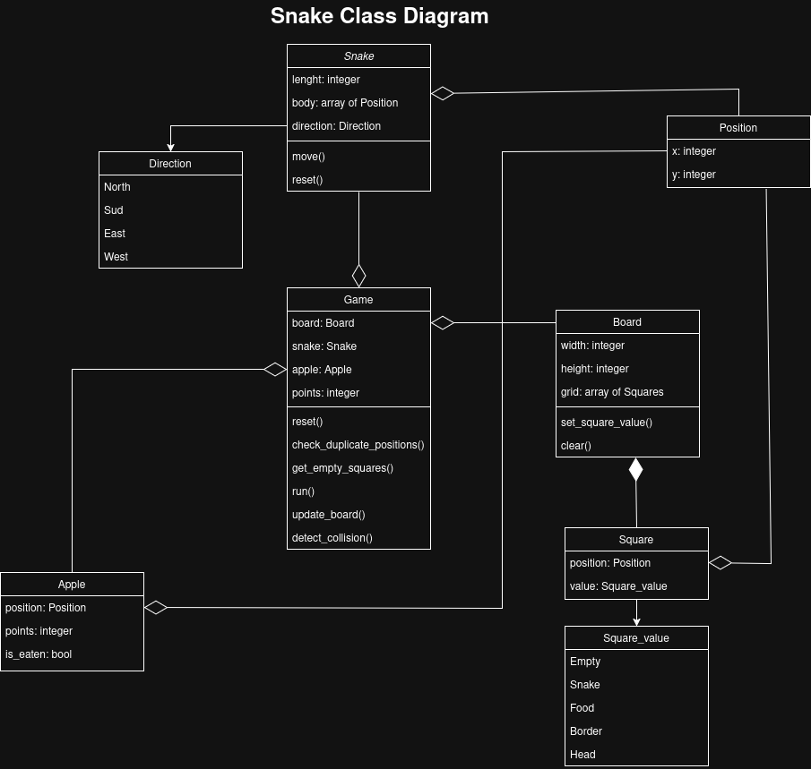
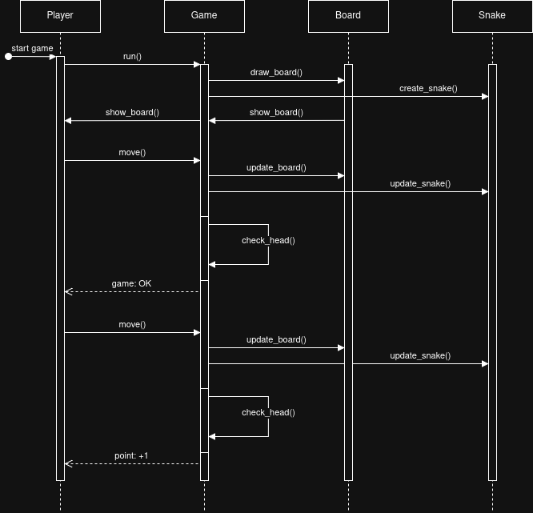

# Snake in Object Oriented Programming (OOP)

Project developed as part of a course on Object Oriented Programming (OOP) at ENSG, year 2025-2026.

## Overview
This project implements the classic Snake game using Object Oriented Programming principles.
The game can be played on the terminal as well as through a graphical user interface (GUI) built with PyQt5.
Developed in Python 3.10.12. 

## Requirements
The `requirements.txt` file contains all the dependencies needed for the project.

## Installation
1. Clone the repository:
   ```bash
   git clone git@github.com:AriannaBoisseau/snake_OOP.git
    ```

2. Navigate to the project directory:
   ```bash
   cd snake_OOP
   ```

3. Create a virtual environment and activate it (optional but recommended):
   ```bash
   python3 -m venv venv
   source venv/bin/activate
   ```

4. Install the required packages:
   ```bash
   pip install -r requirements.txt
   ```

## Usage
To run the game, execute the following command:
   ```bash
   python3 main.py
   ```
Then follow the on-screen instructions to choose between terminal or GUI mode.

## Project Structure
- `main.py`: Entry point of the application.
- `Classes/`: Contains all the core classes for the game logic.
- `GUI_Classes/`: Contains all GUI-related classes and windows.
- `assets/`: Contains images and other assets used in the game.
- `diagrams/`: Contains UML diagrams representing the class structure.
- `pictures/`: Contains screenshots of the game in action.
- `requirements.txt`: Lists all the dependencies for the project.

## Screenshots

### Terminal mode



### GUI mode



## UML Diagrams

### Class Diagram



### Sequence Diagram



### Use Case Diagram

